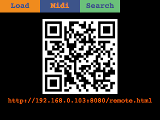
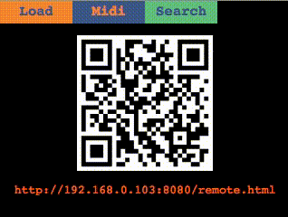

# 
 

This repository is the frontend and main logic for the BeagleBoom project. 
Because of the browser based frontend, the beagle boom supports smartphones and computers as additional screens and remote controls.

# Running it
## Prerequirements
- NodeJS >= 10
    - Yarn (`npm install -g yarn`)
    - PM2 (`npm install pm2`)
- FFmpeg
- mplayer

## Installation
If all requirements are met, just run
```
yarn install
```

## Start
Start the menu with `pm2 start index.js -- 1`

# Remote Screen and Control
By default, a webserver is started on port `8080` and two pages are exposed.

- http://[BEAGLE_BOOM_IP]:8080/index.html => A non interactable rendering of the screen. Used internally by the BeagleBoom on the LCD.
- http://[BEAGLE_BOOM_IP]:8080/remote.html => The screen in conjunction with all rotary encoders and buttons (in form of html buttons). Additionaly a textbox is present for fast text input.

# Creating custom states
[https://github.com/BeagleBoom/Menu/wiki/States]( See the Wiki)

# About this repository
This repository is part of the [BeagleBoom](https://github.com/beagleboom)-Sampler project developed by the academic working group "[Creative Technologies AG](http://www.creative-technologies.de/)" (ctag) at the [University of Applied Sciences Kiel](https://www.fh-kiel.de/).
